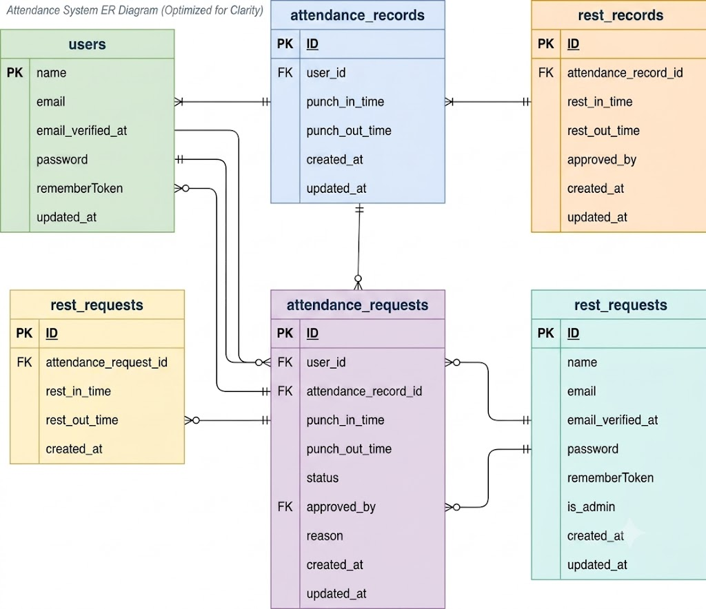

# 🚀 環境構築 (Setup)

以下の手順でローカル開発環境を構築できます。

1. リポジトリをクローンする
```bash
git clone git@github.com:jinichi-haishima/attendance-app.git
cd <プロジェクトのディレクトリ名>
```
2. プロジェクト直下で、以下のコマンドを実行する

```
make init
```
    ※M1/M2/M3 Mac（Apple Silicon）をお使いの方
    Compose.yamlを開きmysqlサービスに platform: 'linux/amd64'を追加してください
## 📩メール認証
mailtrapというツールを使用しています。<br>
以下のリンクから会員登録をしてください。<br>
https://mailtrap.io/

メールボックスのIntegrationsから 「laravel 7.x and 8.x」を選択し、<br>
.envファイルのMAIL_MAILERからMAIL_ENCRYPTIONまでの項目をコピー＆ペーストしてください。<br>
MAIL_FROM_ADDRESSは任意のメールアドレスを入力してください。<br>

## 📄 画面・ルーティング一覧 (Routes & Pages)

システム内の画面、対応するURL、HTTPメソッド、および処理を担当するコントローラーの一覧です。

### 👤 一般ユーザー向け画面
| 画面名 | URLパス | メソッド | 担当コントローラー / 処理 | 認証 |
| :--- | :--- | :---: | :--- | :---: |
| 会員登録画面 | `/register` | GET / POST | Fortify (`register`) | - |
| ログイン画面 | `/login` | GET / POST | Fortify (`login`) | - |
| **出勤登録画面（トップ）** | `/attendance` | GET / POST | `AttendanceController@punch-in` | auth |
| **勤怠一覧画面** | `/attendance/list` | GET | `AttendanceRecordController@index` | auth |
| **勤怠詳細画面** | `/attendance/detail/{id}` | GET | `AttendanceRecordController@detail` | auth |
| **申請一覧画面** | `/stamp_correction_request/list` | GET | `AttendanceRequestController@index` | auth |

### 👑 管理者向け画面
| 画面名 | URLパス | メソッド | 担当コントローラー / 処理 | 認証・権限 |
| :--- | :--- | :---: | :--- | :---: |
| ログイン画面 | `/admin/login` | GET / POST | `Admin/AdminController` (Fortify login) | - |
| **勤怠一覧画面** | `/admin/attendance/list` | GET | `Admin/AdminController@index` | auth & admin |
| **勤怠詳細画面** | `/admin/attendance/{id}` | GET | `Admin/AdminController@detail` | auth & admin |
| **スタッフ一覧画面** | `/admin/staff/list` | GET | `Admin/StaffController@index` | auth & admin |
| **スタッフ別勤怠一覧画面** | `/admin/attendance/staff/{id}`| GET | `Admin/StaffController@show` | auth & admin |
| **申請一覧画面** | `/stamp_correction_request/list` | GET | `Admin/AttendanceRequestController@index` | auth & admin |
| **修正申請承認画面** | `/stamp_correction_request/approve/{id}` | GET / POST | `Admin/AttendanceApprovalController@show/update` | auth & admin |

## 📊 データベース設計 (Database Schema)

### 👤 usersテーブル（ユーザー管理）
| カラム名 | 型 | primary key | unique key | not null | foreign key | 備考 |
| --- | --- | :---: | :---: | :---: | :---: | --- |
| id | bigint unsigned | ◯ |  | ◯ |  | 自動採番ID |
| name | varchar(255) |  |  | ◯ |  | ユーザー名 |
| email | varchar(255) |  | ◯ | ◯ |  | メールアドレス（ログイン用） |
| email_verified_at | timestamp |  |  |  |  | メール認証日時（空を許容） |
| password | varchar(255) |  |  | ◯ |  | ハッシュ化パスワード |
| remember_token | varchar(100) |  |  |  |  | ログイン保持トークン |
| is_admin | boolean |  |  | ◯ |  | 管理者フラグ（デフォルト: false） |
| created_at | timestamp |  |  |  |  | レコード作成日時 |
| updated_at | timestamp |  |  |  |  | レコード更新日時 |

### ⏰ attendance_recordsテーブル（勤怠打刻記録）
| カラム名 | 型 | primary key | unique key | not null | foreign key | 備考 |
| --- | --- | :---: | :---: | :---: | :---: | --- |
| id | bigint unsigned | ◯ |  | ◯ |  | 自動採番ID |
| user_id | bigint unsigned |  |  | ◯ | users(id) | 申請ユーザーID（親削除時連動消去） |
| punch_in_time | datetime |  |  |  |  | 出勤打刻日時（空を許容） |
| punch_out_time | datetime |  |  |  |  | 退勤打刻日時（空を許容） |
| reason | varchar(255) |  |  |  |  | 修正・変更理由（空を許容） |
| created_at | timestamp |  |  |  |  | レコード作成日時 |
| updated_at | timestamp |  |  |  |  | レコード更新日時 |

### ☕ rest_recordsテーブル（休憩打刻記録）
| カラム名 | 型 | primary key | unique key | not null | foreign key | 備考 |
| --- | --- | :---: | :---: | :---: | :---: | --- |
| id | bigint unsigned | ◯ |  | ◯ |  | 自動採番ID |
| attendance_record_id | bigint unsigned |  |  | ◯ | attendance_records(id) | 親勤怠レコードID（親削除時連動消去） |
| rest_in_time | datetime |  |  |  |  | 休憩入り日時（空を許容） |
| rest_out_time | datetime |  |  |  |  | 休憩戻り日時（空を許容） |
| created_at | timestamp |  |  |  |  | レコード作成日時 |
| updated_at | timestamp |  |  |  |  | レコード更新日時 |

### ✉️ attendance_requestsテーブル（勤怠修正申請）
| カラム名 | 型 | primary key | unique key | not null | foreign key | 備考 |
| --- | --- | :---: | :---: | :---: | :---: | --- |
| id | bigint unsigned | ◯ |  | ◯ |  | 自動採番ID |
| user_id | bigint unsigned |  |  | ◯ | users(id) | 申請した一般ユーザーID |
| attendance_record_id | bigint unsigned |  |  | ◯ | attendance_records(id) | 対象の勤怠レコードID |
| punch_in_time | datetime |  |  |  |  | 変更希望の出勤日時（空を許容） |
| punch_out_time | datetime |  |  |  |  | 変更希望の退勤日時（空を許容） |
| status | varchar(255) |  |  | ◯ |  | 承認状態（デフォルト: 'pending'） |
| reason | text |  |  |  |  | 申請理由（長文対応用） |
| approved_by | bigint unsigned |  |  |  | users(id) | 承認した管理者ユーザーID（退職時null） |
| created_at | timestamp |  |  |  |  | レコード作成日時 |
| updated_at | timestamp |  |  |  |  | レコード更新日時 |

### 📝 rest_requestsテーブル（休憩修正申請）
| カラム名 | 型 | primary key | unique key | not null | foreign key | 備考 |
| --- | --- | :---: | :---: | :---: | :---: | --- |
| id | bigint unsigned | ◯ |  | ◯ |  | 自動採番ID |
| attendance_request_id | bigint unsigned |  |  | ◯ | attendance_requests(id) | 勤怠に紐づく申請ID|
| rest_in_time | datetime |  |  |  |  | 変更希望の休憩入り日時（空を許容） |
| rest_out_time | datetime |  |  |  |  | 変更希望の休憩戻り日時（空を許容） |
| created_at | timestamp |  |  |  |  | レコード作成日時 |
| updated_at | timestamp |  |  |  |  | レコード更新日時 |

## ER図


## テストアカウント
name:　ユーザー1（一般）
email: user1@example.com
password: password
メール認証済み
-------------------------
name: ユーザー2（一般）
email: user2@example.com
password: password
メール認証済み
-------------------------
name: ユーザー3（管理者）
email: user3@example.com
password: password
メール認証済み
(is_admin = true)
-------------------------

##　テストデータ
### 【user1 の意図的データ】
* **過去 5 ヶ月**: 各月平日 15 日 = 75 日 の通常勤務（9:00-18:00）
* **当月 17 日 のパターン**:
  * 通常: 10日
  * 残業（9:00-20:00）: 3日
  * 遅刻（9:30-18:00）: 2日
  * 早退（9:00-17:00）: 1日
  * 長時間労働（8:00-21:00）: 1日
* **共通ルール**: user1 の全レコードに 固定休憩 12:00-13:00（1 時間） を付与

### 【user1 で /attendance/report を開いた時の予測値】
* **過去 6 ヶ月 総労働時間**: 744 時間
* **過去 6 ヶ月 総残業時間**: 10 時間（残業判定: 1 日 8 時間超過分）
* **過去 6 ヶ月 平均労働時間 / 日**: 8 時間 5 分
* **当月 遅刻回数**: 2 回（始業 09:00 超過）
* **当月 早退回数**: 1 回（終業 18:00 より前の退勤）
* **当月 長時間労働回数**: 1 日（1 日 10 時間超）

## 🧪 テストの実行方法 (Testing)

本プロジェクトでは、PHPUnitを用いた自動テストを導入しています。
以下のコマンドで、全テストケースを一括実行できます。
```bash
# Dockerコンテナ内でテストを実行
docker-compose exec php php artisan test
```

## 📊 API仕様 (API Endpoints)

システム内でやり取りされる主要なAPIのデータ構造です。

### 📈 勤怠レポートデータ (`summary`)
`/attendance/report` で取得できる統計データの構造です。

| キー名 | 型 | 説明 | 算出ロジック |
| :--- | :---: | :--- | :--- |
| `total_working_hours` | int | 過去6ヶ月の総労働時間 | 各日の（退勤時間 - 出勤時間 - 休憩時間）の合計 |
| `total_overtime_hours`| int | 過去6ヶ月の総残業時間 | 各日の実労働時間のうち、8時間を超過した分の合計 |
| `average_working_hours`| string | 過去6ヶ月の1日あたりの平均労働時間 | 総労働時間 ÷ 出勤日数（◯時間◯分の形式） |
| `late_count` | int | 当月の遅刻回数 | `punch_in_time` が 09:00 を超過しているレコード数 |
| `early_leave_count` | int | 当月の早退回数 | `punch_out_time` が 18:00 より前に退勤しているレコード数 |
| `long_work_count` | int | 当月の長時間労働日数 | 1日の実労働時間が 10 時間を超えている日数 |

### 📅 勤怠詳細データ構造
`/attendance/{id}` やレポート機能等で取得できる勤怠詳細リソース（`AttendanceResource`）のレスポンス構造です。

| キー名 | 型 | 説明 | 元のカラム / 変換ロジック |
| :--- | :---: | :--- | :--- |
| `id` | int | 勤怠レコードID | `attendance_records.id` |
| `user_id` | int | ユーザーID | `attendance_records.user_id` |
| `user` | object | 申請ユーザー詳細 | `UserResource` （Eager Loading時のみ含む） |
| `date` | string | 勤務日（YYYY-MM-DD） | `punch_in_time` から日付のみを抽出 |
| `clock_in` | string | 出勤時間（HH:mm:ss） | `punch_in_time` から時刻のみを抽出 |
| `clock_out` | string | 退勤時間（HH:mm:ss） | `punch_out_time` から時刻のみを抽出 |
| `total_time` | string | 実労働時間（◯時間◯分） | `formatted_work_time`（モデル内のカスタムアクセサ） |
| `total_break_time`| string | 総休憩時間（◯時間◯分） | `formatted_rest_time`（モデル内のカスタムアクセサ） |
| `comment` | string | 修正・変更理由 | `attendance_records.reason` |
| `breaks` | array | 休憩履歴リスト | `AttendanceBreakResource` の配列（リレーション読込時） |
| `applications` | array | 申請履歴リスト | `ApplicationResource` の配列（リレーション読込時） |

---

## 🛠️ 使用技術 (Technologies)

* **Backend**: PHP 8.1 / Laravel 8.x
* **Database**: MySQL 8.0
* **Infrastructure**: Docker / Docker Compose
* **Testing**: PHPUnit